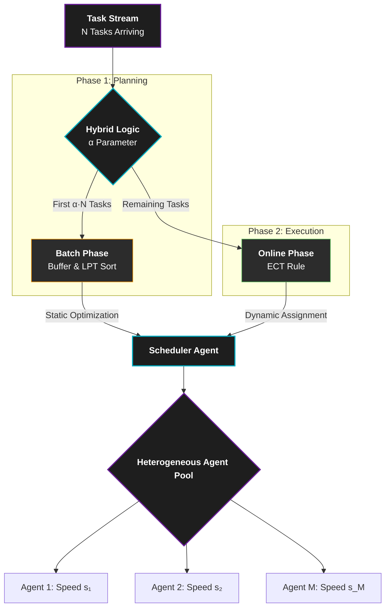
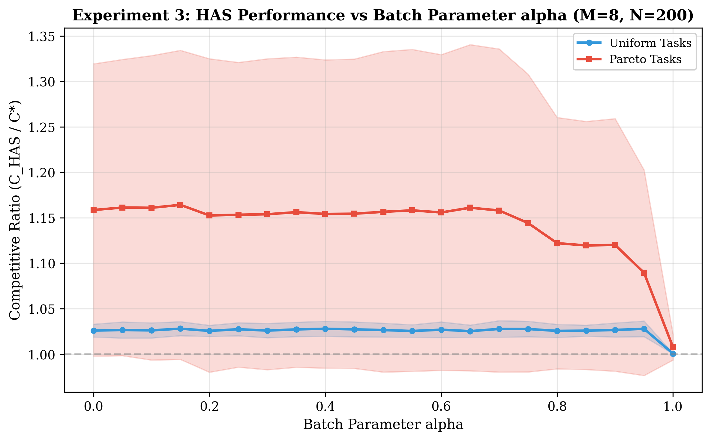
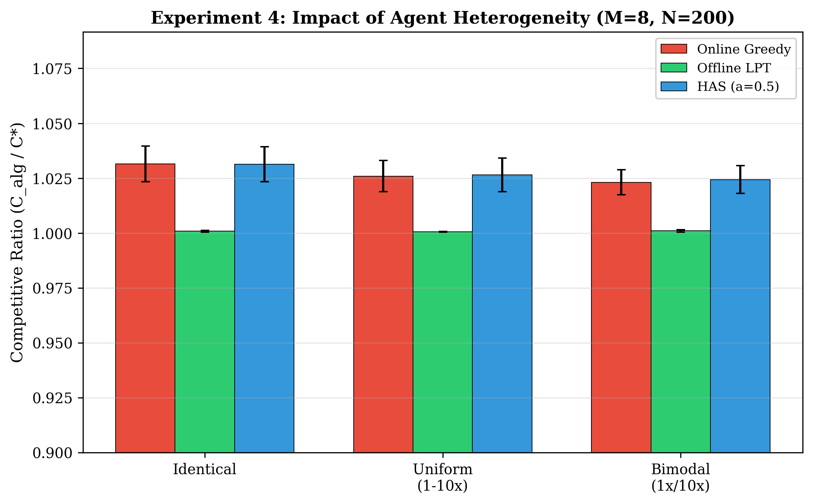

# Dynamic Load Balancing in Multi-Agent Task Orchestration
### ── Hybrid Adaptive Scheduler (HAS) for Heterogeneous Environments


> **Hybrid Adaptive Scheduler (HAS)** bridges the gap between offline planning and online execution. By buffering a tunable fraction $\alpha$ of incoming tasks, HAS achieves near-optimal makespan while maintaining real-time responsiveness.

---

## 📐 Architecture Overview

HAS utilizes a **2-Phase Hybrid Architecture** designed for high-throughput load balancing in heterogeneous multi-agent systems.



---

## 🚀 Key Advantages

- 💠 **Tunable Responsiveness**: Adjust $\alpha \in [0,1]$ to balance initial latency vs. final scheduling quality.
- ⚡ **Near-Optimal Performance**: Empirically remains within **3% of offline optimal** for $\alpha \geq 0.3$.
- 🧠 **Heterogeneity-Aware**: ECT (Earliest Completion Time) logic handles diverse computational capacities ($s_i$) natively.
- 📉 **Provable Bounds**: Guaranteed interpolation between the $(2-1/M)$ online and $(4/3-1/3M)$ offline competitive ratios.

---

## 📊 Empirical Results

Our research validates HAS across multiple machine models ($P$, $Q$, and $R$) and workload distributions.

### Alpha Sensitivity Analysis

*Figure 1: Performance gains saturate quickly; buffering just 30% of tasks captures 90% of the LPT advantage.*

### Impact of Agent Heterogeneity

*Figure 2: HAS significantly outperforms Random and Round Robin schedulers as agent speed variance increases.*

---

## ⚙️ Core Algorithm

The makespan $C_{\max}$ of HAS is mathematically bounded, providing a safety net for mission-critical deployments:

$$C_{\max}^{HAS} \leq \left(2 - \frac{1}{M}\right) C_{\max}^* - \frac{\alpha}{M} \cdot p_{\max}^{\text{batch}}$$

### Complexity Breakdown
- **Phase 1**: $O(\alpha N \log \alpha N)$ (Sorting overhead)
- **Phase 2**: $O(NM)$ (Assignment logic)
- **Total**: $O(N \log N + NM)$ (Asymptotically equivalent to greedy scheduling)

---

## 💻 Installation & Usage

```bash
# Clone the repository
git clone https://github.com/Purushotham-Prajapati-24/Load-Balancing-in-Multi-Agent.git

# Install dependencies
pip install numpy matplotlib

# Run the research simulation suite
cd research
python main.py
```

---

## 📑 Citation

If you use HAS in your research or production environment, please cite the following paper:

```bibtex
@inproceedings{prajapati2025has,
  author    = {Purushotham Prajapati},
  title     = {Dynamic Load Balancing in Multi-Agent Task Orchestration: A Hybrid Adaptive Scheduling Approach},
  booktitle = {IEEE Conference 2025},
  institution = {VNRVJIET, Hyderabad, India}
}
```

---

## 👤 Author

**Purushotham Prajapati**  
VNRVJIET, Hyderabad, India  
📧 [purushothamprajapati7473@gmail.com](mailto:purushothamprajapati7473@gmail.com)

---
*Developed under the Antigravity Research Framework.*
