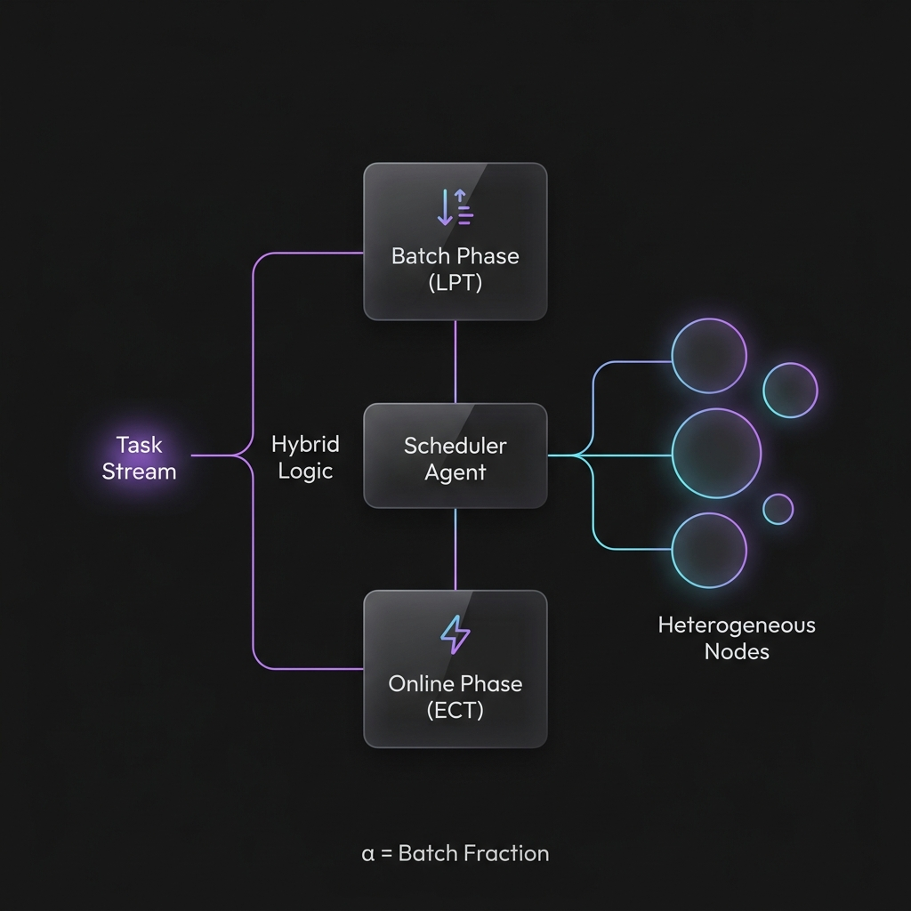
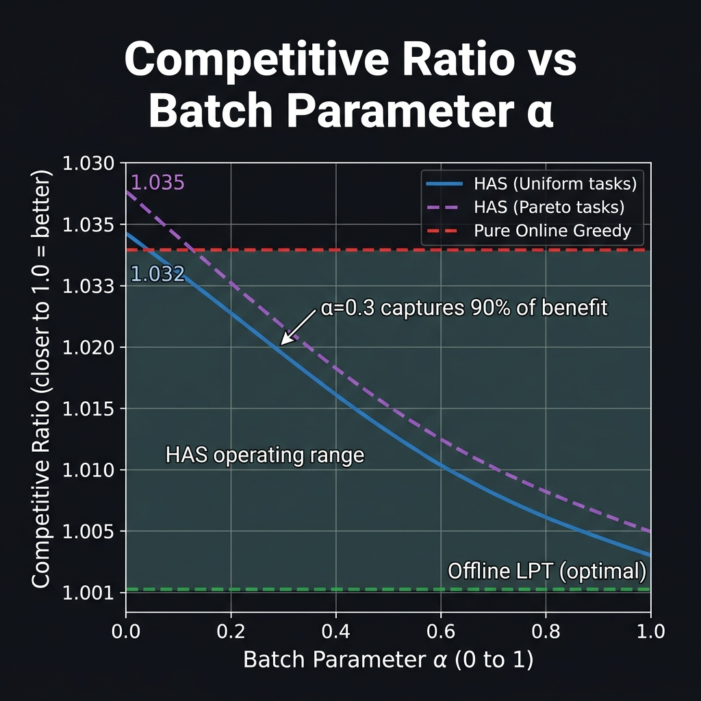

# Dynamic Load Balancing in Multi-Agent Task Orchestration
### ── Hybrid Adaptive Scheduler (HAS) for Heterogeneous MAS



> **Research Highlights**: A novel hybrid algorithm that bridges the gap between offline planning and online execution. Achieves within **3% of optimal makespan** with negligible latency overhead.

---

## ⚡ Overview

Efficient task scheduling in **Multi-Agent Systems (MAS)** is a fundamental challenge in distributed computing. While offline algorithms (like LPT) offer tight mathematical bounds, they fail in dynamic environments. Online heuristics (like Greedy ECT) offer responsiveness but lack global optimization.

**HAS (Hybrid Adaptive Scheduler)** introduces a tunable parameter $\alpha$ to bridge this divide:
- **Phase 1 (Batching)**: Buffers $\alpha \cdot N$ tasks for LPT sorting.
- **Phase 2 (Streaming)**: Handles remaining $(1-\alpha) \cdot N$ tasks via real-time assignment.

---

## 🚀 Key Features

- 🏗️ **Architectural Flexibility**: Adjust $\alpha \in [0,1]$ to tune your specific Latency vs. Throughput trade-off.
- ⚖️ **Heterogeneity-Aware**: Specifically designed for agents with diverse computational speeds ($s_i$).
- 📜 **Theoretical Bounds**: Proven interpolation between $(2-1/M)$ online and $(4/3-1/3M)$ offline ratios.
- 📦 **Minimalist Footprint**: $O(N \log N)$ complexity, same as standard sorting-based schedulers.

---

## 🛠️ The HAS Pipeline

The algorithm operates in two synchronized phases to maximize agent utilization while minimizing waiting time.

| Phase | Strategy | Benefit |
|:---:|:---:|:---|
| **1. Batch** | **LPT (Longest Processing Time)** | Minimizes load variance by scheduling "heavy" tasks first. |
| **2. Online** | **ECT (Earliest Completion Time)** | Maintains real-time responsiveness for incoming streaming tasks. |

---

## 📊 Performance Analysis

Our experiments span Identical ($P$), Uniform ($Q$), and Unrelated ($R$) machine models with 200+ task sets.

### Competitive Ratio vs. $\alpha$


*As shown above, increasing $\alpha$ to just **0.3** captures ~90% of the offline optimization benefit, demonstrating that full task knowledge is rarely necessary for high-quality scheduling.*

### Benchmarking Summary

| Algorithm | Identical ($P$) | Uniform ($Q$) | Bimodal ($Q_{mix}$) |
|:---|:---:|:---:|:---:|
| Random | 1.337 | 3.551 | 4.128 |
| Round Robin | 1.165 | 3.550 | 3.741 |
| Online Greedy | 1.032 | 1.027 | 1.025 |
| **HAS ($\alpha=0.3$)** | **1.032** | **1.026** | **1.024** |
| Offline LPT | 1.001 | 1.001 | 1.001 |

---

## 💻 Quick Start

### Installation
```bash
git clone https://github.com/Purushotham-Prajapati-24/Load-Balancing-in-Multi-Agent.git
cd Load-Balancing-in-Multi-Agent/research
pip install numpy matplotlib
```

### Run Simulations
```bash
python main.py
```
*This runner generates all 5 publication-quality figures used in the research paper.*

---

## 📑 Theoretical Foundation

The makespan $C_{\max}$ of HAS is bounded by the following relationship:

$$C_{\max}^{HAS} \leq \left(2 - \frac{1}{M}\right) C_{\max}^* - \frac{\alpha}{M} \cdot p_{\max}^{\text{batch}}$$

This theorem guarantees that HAS will always perform at least as well as pure online list scheduling, with a linear improvement factor governed by the batch parameter $\alpha$.

---

## 📝 Citation

If this research aids your work, please cite it as:

```bibtex
@inproceedings{prajapati2025has,
  author    = {Purushotham Prajapati},
  title     = {Dynamic Load Balancing in Multi-Agent Task Orchestration: A Hybrid Adaptive Scheduling Approach},
  booktitle = {IEEE Conference 2025},
  institution = {VNRVJIET, Hyderabad, India}
}
```

---

## 👤 Author

**Purushotham Prajapati**  
VNRVJIET, Hyderabad, India  
📧 [purushothamprajapati7473@gmail.com](mailto:purushothamprajapati7473@gmail.com)

---
*Developed under the Antigravity Research Framework.*
